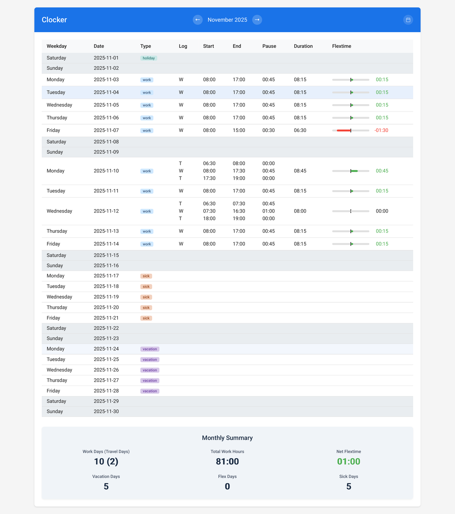
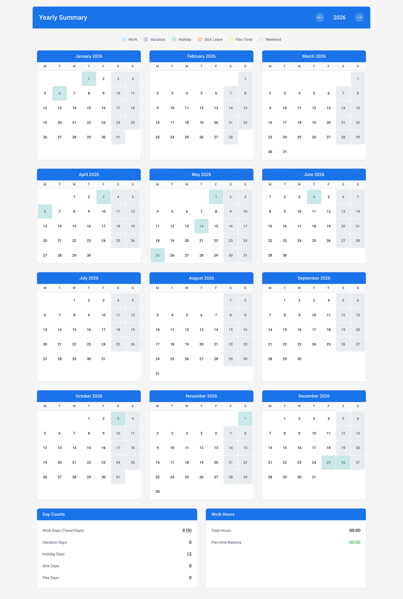

# Clocker

[](https://www.python.org/)
[](https://fastapi.tiangolo.com/)
[](https://opensource.org/licenses/MIT)
[](https://github.com/brokdar/clocker/pkgs/container/clocker)

> A modern time tracking application with calendar management and compliance monitoring



## Features

- **Time Logging** - Track work and travel time with pause support and open-ended logs
- **Calendar Management** - Manage work days, vacation, holidays, sick leave, and flextime
- **Statistics & Analytics** - View flextime balance, monthly and yearly summaries
- **Compliance Monitoring** - Automatic validation of break times, max work hours, and rest periods
- **Dual Interface** - Full-featured Web UI and REST API
- **German Holidays** - Auto-populated public holidays by state

### Yearly Statistics



## Quick Start

### Prerequisites

- Python 3.12+
- [UV](https://docs.astral.sh/uv/) package manager

### Run Locally

```bash
# Install UV (if not already installed)
curl -LsSf https://astral.sh/uv/install.sh | sh

# Install dependencies and run
uv sync
uv run fastapi dev app/main.py
```

Open [http://localhost:8000](http://localhost:8000)

### Run with Docker

```bash
docker build -t clocker .
docker run -d -p 8000:8000 clocker
```

## Development

### Local Setup

```bash
uv sync                            # Install dependencies
uv run fastapi dev app/main.py     # Start dev server with hot reload
uv run pytest                      # Run tests
uv run ruff check . --fix          # Lint and auto-fix
uv run mypy .                      # Type check
```

### DevContainer (VS Code)

1. Open project in VS Code
2. Click **"Reopen in Container"** when prompted
3. Run `uv run fastapi dev app/main.py`

Everything is pre-configured - dependencies, linting, and extensions.

## API Documentation

Interactive API documentation is available at [http://localhost:8000/docs](http://localhost:8000/docs) when the server is running.

## License

This project is licensed under the MIT License - see the [LICENSE](LICENSE) file for details.
